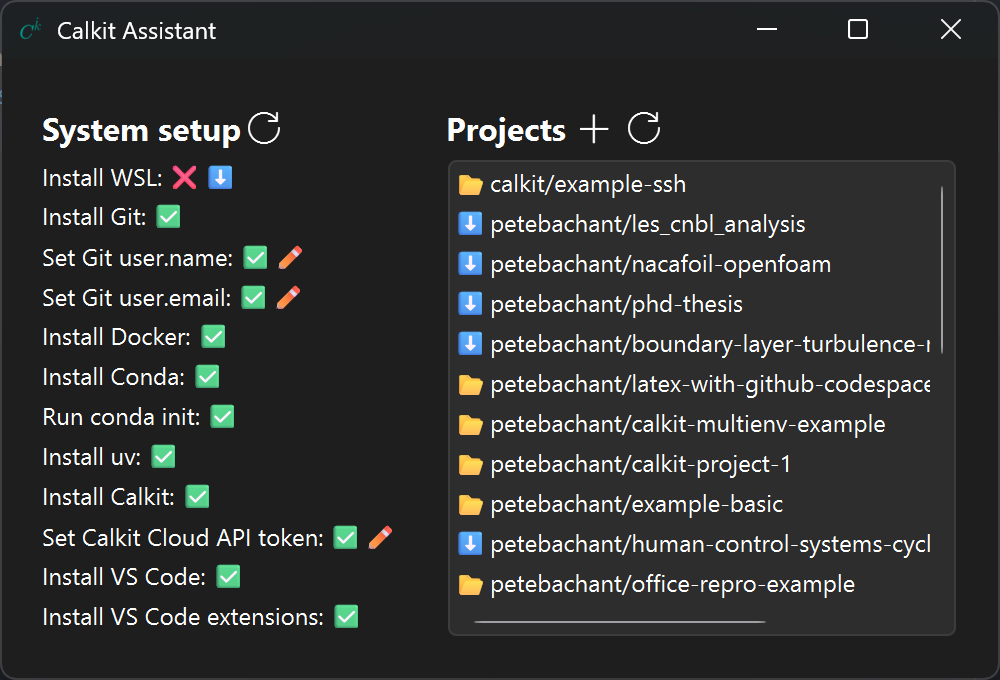

# Calkit Assistant

A desktop app to help set up and manage
a modern, open-source scientific computing environment.

## Getting started

Simply download and run the executable from the
[⬇️latest release](https://github.com/calkit/calkit-assistant/releases/latest).
